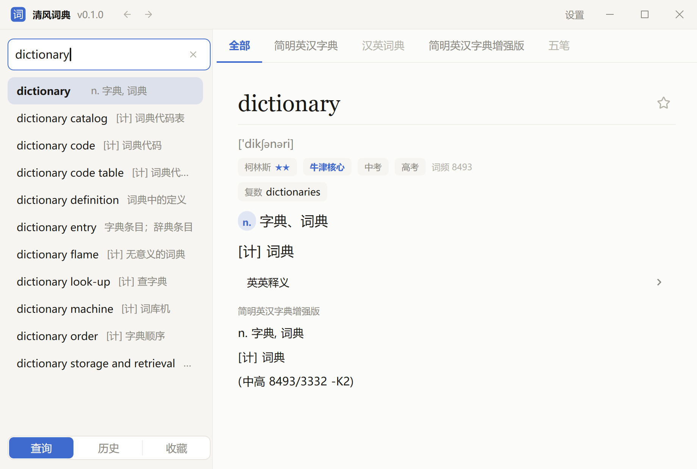

<p align="center">
  
</p>

<h1 align="center">清风词典 (wind-dict)</h1>

<p align="center">
  常驻托盘的桌面词典：全局热键唤起，离线查词
</p>

<p align="center">
  
  
  <a href="../../releases/latest"></a>
</p>

<p align="center">
  <a href="../../releases/latest"><b>下载</b></a> ·
  <a href="../../issues"><b>问题反馈</b></a> ·
  <a href="docs/adr/"><b>设计决策</b></a>
</p>

<p align="center">
  
</p>

## 特性

- **热键唤起，用完即走** — 默认 `Ctrl + Alt + X` 呼出，`Esc` 收起；关窗口只是收进托盘
- **全离线** — 英汉 77 万词条、汉英 12 万词条随程序分发，不联网、不登录、无遥测
- **中英双向** — 方向由查询词自动判定，没有需要先切换的开关
- **边打边补全** — 候选实时刷新，`↑ ↓` 走、`Enter` 查，全程不必碰鼠标
- **字形信息** — 汉字附部首、笔画、繁简对应与大陆标准读音
- **用户词典** — 把 `.mdx` 丢进词典目录即可使用，运行时直读，不导入、不转换
- **码表反查** — 装了[清风输入法](https://github.com/huanfeng/WindInput)时，顺带告诉你这个字怎么打、怎么拆
- **历史与收藏** — 查过的词自动记下，在意的词标个星
- **三套配色** — 简约 / 纸感 / 专注，各有亮暗两档，可跟随系统

## 安装

**scoop**（推荐，升级方便）

```pwsh
scoop bucket add huanfeng https://github.com/huanfeng/scoop-bucket
scoop install wind-dict
```

**手动**

从 [Releases](../../releases/latest) 下载 `wind-dict-<版本>-x64.zip`，解压到一个**空目录**，
双击 `wind-dict.exe`。包内没有套一层目录（scoop 要求如此），所以别解压到下载目录根上。

程序是绿色的：`wind-dict.exe` 与三份 `.db` 必须放在一起，删掉目录即卸载。
安装包未经过签名，首次运行若被 SmartScreen 拦下，按提示放行即可。

> 包约 150 MB，词库占了绝大部分——三份词库随程序分发，装完就能查，不需要另外下载。

## 使用

呼出后直接打字，左栏出候选，右栏出释义。

| 按键 | 作用 |
|---|---|
| `Ctrl + Alt + X` | 全局唤起 / 收起（可在设置里改） |
| `Ctrl + L` | 定位到查询框并全选 |
| `↑` `↓` | 在左栏列表里移动，右栏实时跟随 |
| `→` | 把选中的候选填进查询框 |
| `Enter` | 查询选中的词，并记入历史 |
| `Ctrl + ←` `→` | 沿查询路径后退 / 前进 |
| `Ctrl + C` | 复制右栏选中的文字（整片可拖选） |
| `Esc` | 收起窗口 |

完整键位见设置页的「常规 → 快捷键」。

## 词典与数据

随程序分发三份词库，放在 `wind-dict.exe` 同目录：

| 文件 | 内容 | 上游 |
|---|---|---|
| `ecdict.db` | 英汉 77 万词条 | [ECDICT](https://github.com/skywind3000/ECDICT) |
| `cedict.db` | 汉英 12 万词条 | [CC-CEDICT](https://www.mdbg.net/chinese/dictionary?page=cc-cedict) |
| `unihan.db` | 10 万汉字的部首、笔画、繁简、读音 | [Unihan](https://www.unicode.org/reports/tr38/) |

**用户词典**：把 `.mdx` 复制到 `%LOCALAPPDATA%\wind-dict-data\dicts\`，在「设置 → 词典」里
逐本开关、改名、排顺序。找不到那个目录就点设置页里的「打开」。发布包里带了一本示例词典
（`dicts-example\`）可以直接试。

**码表反查**：自动探测机器上已装的清风输入法，把它的方案（五笔等）作为一本词典加进来。
第三方方案（虎码、小鹤……）按同样的格式放进方案目录即可自动出现，不需要改代码。

**你的数据在别处**：收藏、历史与设置存在 `%LOCALAPPDATA%\wind-dict-data\`，
不在程序目录内——升级、重装、卸载都不会动它们。

## 从源码构建

需要 Rust stable 与 Windows 10/11。GUI 库 [wind-ui-rust](https://github.com/huanfeng/wind-ui-rust)
是 path 依赖，必须**并排**放在同级目录：

```
workspace/
├── wind-dict/
└── wind-ui-rust/
```

```pwsh
.\scripts\dev.ps1          # 交互菜单
.\scripts\dev.ps1 gd b     # 生成词库（首次要几分钟）+ 构建
.\scripts\dev.ps1 i        # 全新部署并启动
.\scripts\dev.ps1 ci       # fmt + clippy + test
```

词库不入库，由 `gd` 下载上游数据现场构建。CI 检出的 wind-ui-rust 版本钉在
[`windui.ref`](windui.ref) 里，改动它请用 `.\scripts\dev.ps1 pin`。

## 文档

- [CONTEXT.md](CONTEXT.md) — 术语表。代码里的命名由它推出，含一批**明令禁止**的名字
- [DESIGN.md](DESIGN.md) — 界面设计基线
- [docs/adr/](docs/adr/) — 架构决策记录，其中数条专门用于阻止「看起来更优」的重构

改代码前先读前两份。

## 许可证

本项目源代码采用 [MIT 许可证](LICENSE)。

随程序分发的**词库数据**来自 ECDICT、CC-CEDICT、Unihan 等第三方项目，适用各自的许可证
条款——其中 `cedict.db` 源自 CC-CEDICT，按 CC BY-SA 4.0 分发。完整声明见
[THIRD-PARTY.md](THIRD-PARTY.md)。

## 相关项目

- [清风输入法 (WindInput)](https://github.com/huanfeng/WindInput) — 兄弟项目，本词典的码表反查读它的方案数据
- [wind-ui-rust](https://github.com/huanfeng/wind-ui-rust) — 本项目的 GUI 库
